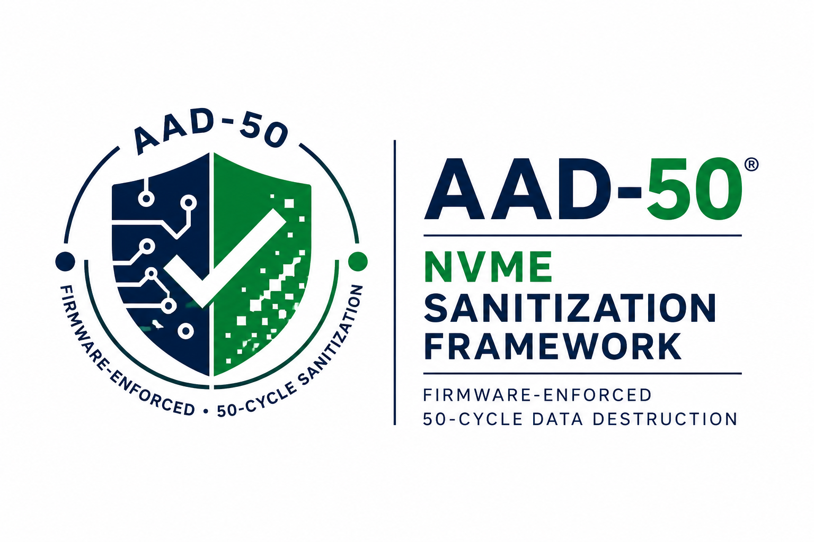
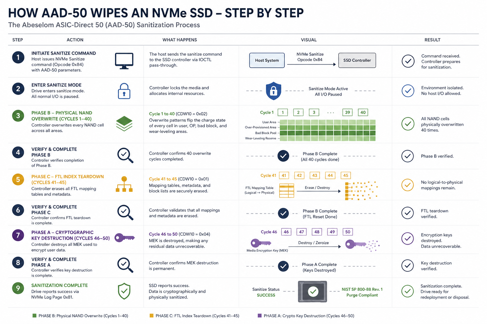
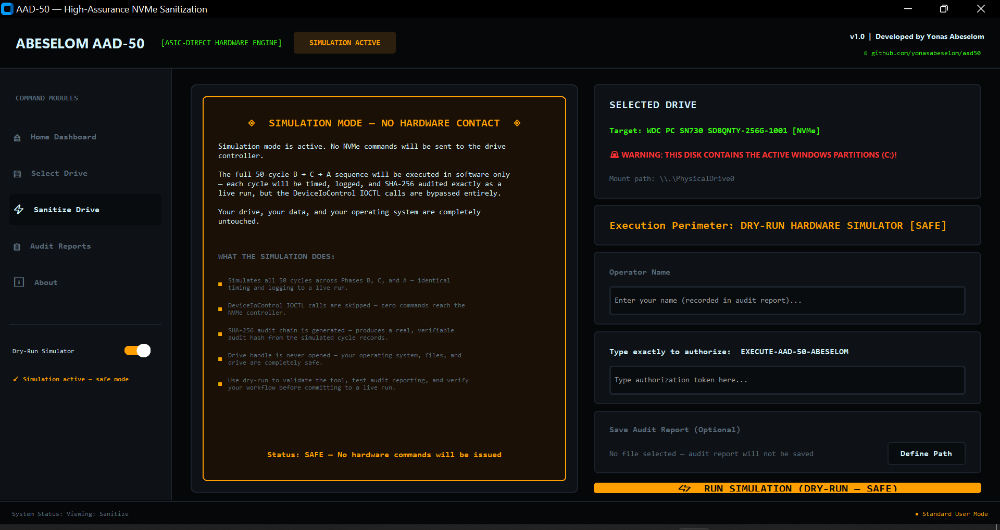
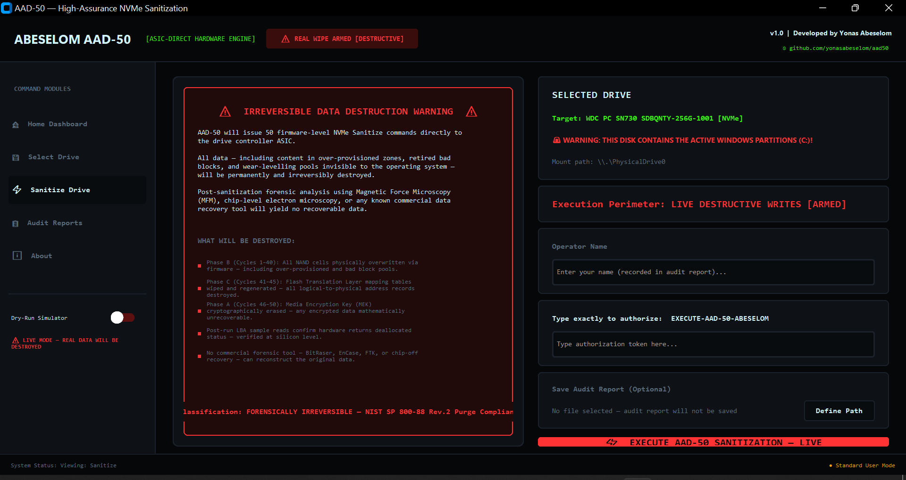
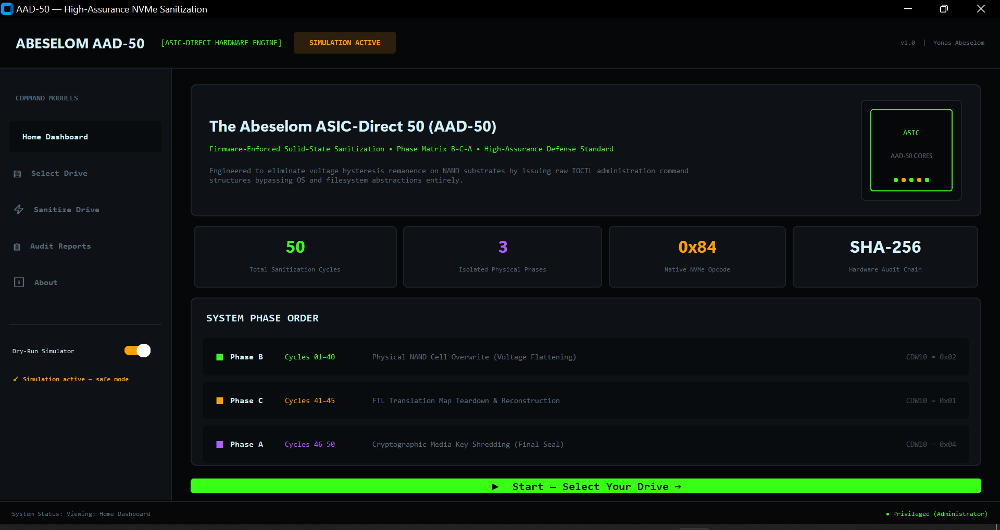
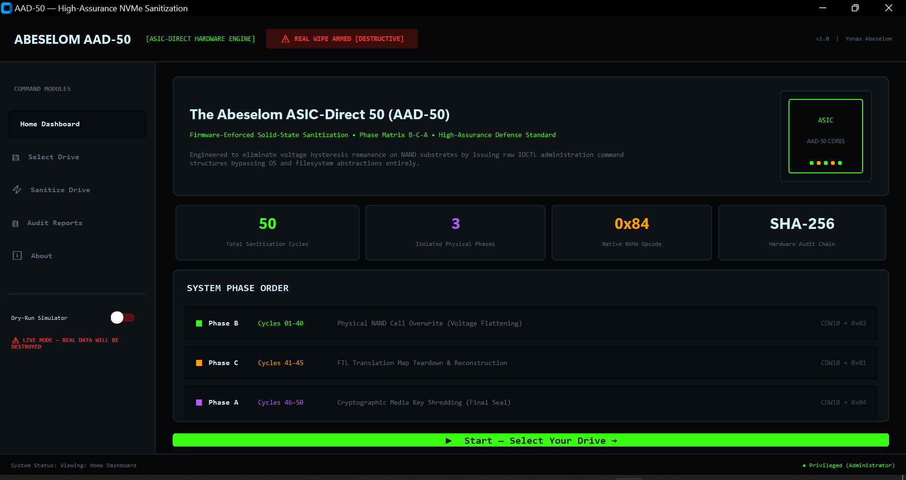

# The Abeselom ASIC-Direct 50 (AAD-50)

<p align="center">
  
</p>

<p align="center">
  <a href="https://github.com/yonasabeselom/aad50/stargazers">
    
  </a>
  <a href="https://github.com/yonasabeselom/aad50/network/members">
    
  </a>
  <a href="https://github.com/yonasabeselom/aad50/watchers">
    
  </a>
  <a href="https://github.com/yonasabeselom/aad50/releases">
    
  </a>
  <a href="https://github.com/yonasabeselom/aad50/blob/main/LICENSE">
    
  </a>
</p>

<p align="center">
  <b>⭐ If AAD-50 is useful to you, please star this repository — it helps other security professionals find it.</b>
</p>

### Firmware-Enforced Flash Sanitization Specification for NVMe Solid-State Storage

**Author:** Yonas Abeselom — BSc Computer Science | Diploma in Information Technology  
**Contact:** yonas_abeselom@protonmail.com | https://github.com/yonasabeselom  
**Version:** 1.1 — June 2026  
**Status:** Open for peer review

---

## Abstract

The Abeselom ASIC-Direct 50 (AAD-50) is a firmware-enforced, 50-cycle data sanitization specification designed explicitly for NVMe solid-state drives. By leveraging low-level IOCTL pass-through structures to communicate directly with the on-drive ASIC, AAD-50 bypasses the operating-system filesystem layer entirely. The protocol executes a deterministic three-phase destruction matrix — physical NAND cell overwrite, Flash Translation Layer index teardown, and cryptographic key destruction — each cycle gated by active polling of NVMe Log Page 0x81 (Sanitize Status) to guarantee hardware-confirmed completion before the next cycle is issued.

The result is a probabilistically modelled, high-assurance sanitization protocol designed to defeat all currently known digital and analog forensic recovery techniques — fully auditable via SHA-256 tamper-evident chain-of-custody, and aligned with NIST SP 800-88 Rev. 2 Purge classification and the NVMe Base Specification 2.0/2.1 Sanitize command set.

---

## How AAD-50 Works — Step by Step



---

## The Problem

Traditional data sanitization standards (DoD 5220.22-M, Gutmann 35-pass) were engineered for magnetic hard disk drives. On solid-state drives, they are fundamentally ineffective.

**The scale of the problem in 2026 is severe:**

- **42%** of used drives purchased from online marketplaces contain recoverable sensitive data *(Blancco, 2025)*
- **67%** of SSD data remains recoverable after standard overwrite techniques *(University of California San Diego)*
- **32%** of organisational data leaks are attributed to redeployed drives retaining sensitive data *(2026 State of Data Sanitization Report)*
- **Only 30.7%** of drives are properly sanitised before resale — researchers recovered over 6 million files from 42 drives *(Secure Data Recovery, 2026)*
- **36%** of enterprises experienced data exposure due to residual SSD data after attempted sanitisation *(Ponemon Institute)*
- **94%** of organisations believe their devices are fully sanitised — but the evidence proves this confidence is misplaced *(Blancco, 2026)*
- **75%** of organisations undergoing audits will require auditable sanitisation logs by 2026 *(Gartner)*

**The peer-reviewed research timeline is unambiguous:**

- **Wei et al. (USENIX FAST 2011)** — Tested 15 sanitization protocols on real ATA/SCSI-based SSDs (NVMe did not exist commercially at the time). Every single one failed. Recovered between 40MB and 1GB of data from a 1GB test file using every protocol — including DoD 5220.22-M, Gutmann 35-pass, British HMG IS5, German VSITR, and Mac OS X Secure Erase. The 12 drives tested used ATA SECURITY ERASE UNIT and ACS-2 SANITIZE BLOCK ERASE commands — the ATA precursors to NVMe Opcode 0x84. Concluded that reliable SSD sanitization requires built-in, **verifiable** sanitize operations. The NAND flash architectural vulnerabilities they documented — FTL over-provisioning, stale data in wear-levelling pools, firmware bugs causing silent failure — are interface-agnostic and apply equally to modern NVMe drives.
- **Hasan and Ray (USENIX Security 2020)** — Proved that data is **partially or completely recoverable** from NAND flash even after digital sanitization ("scrubbing"). Exploited the analog threshold voltage distribution of flash cells — residual electrical charge that persists even after a digital erase. Demonstrated recovery using **standard digital interfaces** with no exotic hardware. Concluded that analog sanitization through multiple overwrite cycles is essential for true data destruction.

These two independent peer-reviewed studies, published nine years apart at the most prestigious security conferences in the world, reach the same conclusion: **single-pass digital sanitization is insufficient.** AAD-50 is the first open, deployable protocol designed to address both findings simultaneously.

The Flash Translation Layer (FTL) constantly intercepts host writes and redirects data to fresh physical blocks. When standard software attempts to overwrite a drive, the target data is not destroyed — it is merely unmapped. The original data remains fully intact in:

- **Over-provisioned zones** — 7%–27% of raw capacity, completely invisible to the OS
- **Retired bad blocks** — degraded cells isolated by the FTL but never erased
- **Wear-levelling pools** — historical data preserved across charge-trap nitride layers

Recovering this data via direct threshold voltage analysis using the drive's own read interface — as Hasan and Ray demonstrated at USENIX Security 2020 requiring no exotic hardware — is the primary documented attack vector. Physical techniques including scanning electron microscopy and Kelvin Probe Force Microscopy (KPFM) apply to planar NAND geometries — modern 3D TLC and QLC NAND makes physical probing significantly harder, and no public demonstration of microscopy-based recovery from 3D TLC NAND is known at the time of writing. Note: Magnetic Force Microscopy (MFM) applies to magnetic HDDs — it is not relevant to NAND flash.

---

## The AAD-50 Solution

AAD-50 bypasses the OS and communicates directly with the drive controller via firmware-level NVMe Sanitize commands (Opcode `0x84`) that the on-chip ASIC executes internally at silicon speeds.

- **Linux:** via three-tier USB/NVMe passthrough auto-detection:
  - **Tier 1** — `nvme_admin_cmd` IOCTL (`0xC0484E41`) — NVMe direct (`/dev/nvme*`, full Log Page 0x81)
  - **Tier 2** — `SG_IO` ioctl — ATA SANITIZE via SCSI ATA PASS-THROUGH (16) (`/dev/sg*`, USB enclosures)
  - **Tier 3** — `BLKDISCARD` ioctl — block layer discard fallback (`/dev/sd*`)
- **Windows:** via `DeviceIoControl` with three-tier USB/NVMe passthrough auto-detection:
  - **Tier 1** — `IOCTL_STORAGE_PROTOCOL_COMMAND` (`0x0002D14C`) — NVMe direct (M.2/PCIe + UASP enclosures)
  - **Tier 2** — `IOCTL_ATA_PASS_THROUGH` (`0x0004D02C`) — ATA SANITIZE via SCSI/SAT (USB enclosures)
  - **Tier 3** — `IOCTL_STORAGE_REINITIALIZE_MEDIA` (`0x0002D504`) — Windows storage stack fallback

### Phase Execution Matrix

| Phase | Cycles | Action | CDW10 |
|---|---|---|---|
| B — Physical NAND Cell Overwrite | 1–40 | Firmware Overwrite | `0x02` |
| C — Flash Translation Layer Reset | 41–45 | Block Erase | `0x01` |
| A — Cryptographic Key Destruction | 46–50 | Crypto Erase | `0x04` |

The deliberate **B → C → A** ordering is a security design decision. Physical cell overwrite runs first so that if a mid-sequence hardware fault occurs, raw NAND data has already been cleared. Cryptographic key destruction runs last as the final seal.

**Why 40 cycles for Phase B?**

An important distinction: NVMe Sanitize (Opcode 0x84) with NSID=0xFFFFFFFF already reaches all physical blocks — including over-provisioned zones, bad block pools, and wear-levelling reserves — in a single correctly executed cycle. The FTL coverage problem Wei et al. documented on ATA/SCSI drives is addressed by the NVMe Sanitize architecture itself.

The 40-cycle allocation is justified on two separate grounds:

**1. Firmware fault redundancy.** Wei et al. found 3 of 12 drives silently failed sanitization while reporting success. This firmware fault pattern is interface-agnostic. AAD-50's per-cycle Log Page 0x81 polling detects any cycle that fails — multiple cycles provide redundancy against transient firmware faults.

**2. Analog threshold voltage — qualified applicability.** Hasan and Ray (USENIX Security 2020) demonstrated data recovery from digitally sanitized NAND via threshold voltage analysis. Their specific technique targets the distinction between "weak zeros" (original programmed bits that lose charge during erase) and "strong zeros" (freshly programmed bits over erased cells during scrubbing). This applies where NVMe Sanitize Overwrite (CDW10=0x02) creates a scrubbing pattern — programming zeros over erased cells. Whether this condition holds depends on the firmware implementation and varies by manufacturer. The technique also appears most applicable to SLC NAND — for modern 3D TLC and QLC, multi-level threshold voltage distributions make the distinction significantly harder to exploit. No public demonstration on 3D TLC NAND is known at the time of writing.

The primary justification for 40 cycles therefore remains **firmware fault redundancy** per Wei et al. The Hasan and Ray argument provides secondary, qualified justification where the scrubbing condition holds.

### Async Polling — The Critical Distinction

The NVMe Sanitize command is **asynchronous**. The drive controller acknowledges the command instantly while performing the actual erasure in the background. Issuing 50 consecutive commands without confirmation produces a race condition that defeats the multi-cycle guarantee entirely.

AAD-50 mandates active polling of **NVMe Log Page 0x81** (Sanitize Status) after every single cycle dispatch. The next cycle is only issued once the SSTAT field returns `0x1` (Completed Successfully) or `0x0` (Idle). Any error code aborts the sequence immediately and writes a fault record to the audit log.

This is the architectural detail that distinguishes AAD-50 from naive multi-pass implementations.

---

## Protocol Comparison

| Standard | Era | Bypasses FTL? | Clears OP Zones? | Clears Bad Blocks? | NAND Wear |
|---|---|---|---|---|---|
| DoD 5220.22-M (3-pass) | HDD 1995 | No | No | No | High |
| Gutmann (35-pass) | HDD 1996 | No | No | No | Extreme |
| NIST SP 800-88 (1-pass) | SSD 2014 | Yes | Yes | Vendor-dependent | Very Low |
| **AAD-50 (50-cycle)** | **NVMe 2026** | **Yes** | **Yes (Full)** | **Yes (SED Purge)** | **Optimised** |

---

## Reference Implementation

AAD-50 is available as a reference implementation on both **Linux** and **Windows**. Both versions execute the identical 50-cycle B → C → A destruction matrix via firmware-level NVMe Sanitize commands — only the OS interface layer differs.

| File | Platform | Interface | Status |
|---|---|---|---|
| `aad50_abeselom.py` | Linux 5.15+ | `nvme_admin_cmd` IOCTL — 3-tier USB/NVMe auto-detect | Stable v1.1 |
| `aad50_abeselom_windows.py` | Windows 10 1607+ / 11 | `DeviceIoControl` — 3-tier USB/NVMe auto-detect | Beta v1.1 |
| `aad50_gui_windows.py` | Windows 10 1607+ / 11 | GUI — requires `aad50_abeselom_windows.py` | Beta v1.1 |

> **Linux v1.1 — USB Enclosure Support:** The Linux implementation now includes three-tier passthrough auto-detection. Point AAD-50 at `/dev/sdb` (USB block device) or `/dev/sg1` (SCSI generic) and it automatically probes Tier 1 (NVMe direct), Tier 2 (ATA SANITIZE via SG_IO/SAT), and Tier 3 (BLKDISCARD). The active pathway is recorded in the audit report.

> **Windows v1.1 — USB Enclosure Support:** The Windows port now includes three-tier passthrough auto-detection for NVMe drives connected via USB enclosures (UASP). The tool probes Tier 1 (NVMe direct), Tier 2 (ATA SCSI/SAT), and Tier 3 (Storage reinitialize) automatically and executes all 50 cycles through whichever pathway the enclosure supports. The active pathway is recorded in the audit report. Hardware testing across enclosure bridge chips is ongoing — if you test via USB, please open a GitHub Issue with your enclosure model and bridge chip.

### GUI Application

The Windows GUI application (`aad50_gui_windows.py`) provides a full graphical interface for AAD-50 with five screens:

- **Home Dashboard** — phase matrix, stats, and quick start
- **Select Drive** — auto-detects all NVMe drives with model, path, and volume labels — including USB-attached NVMe drives (shown with `[USB]` tag)
- **Sanitize Drive** — destruction warning shield, authorization token, live 50-cycle progress dashboard, active passthrough pathway display
- **Audit Reports** — load and verify any saved JSON audit report via SHA-256 hash recalculation
- **About** — tool information, compliance standards, OEM driver diagnostic

**Simulation Mode — Sanitize Screen (Dry-Run ON):**
[](https://github.com/yonasabeselom/aad50/blob/main/AAD50_Sanitize_Simulation.png)

**Live Mode — Sanitize Screen (Dry-Run OFF):**
[](https://github.com/yonasabeselom/aad50/blob/main/AAD50_Sanitize_Live.png)

**Simulation Mode — Home Dashboard:**


**Live Mode — Home Dashboard:**


**GUI Requirements:**
```
pip install customtkinter
pip install reportlab
```

Both `aad50_gui_windows.py` and `aad50_abeselom_windows.py` must be in the same folder.

**Run the GUI:**
```
python aad50_gui_windows.py
```

### Standalone Windows Executable

A pre-built standalone `AAD50.exe` is available in the [latest release](https://github.com/yonasabeselom/aad50/releases/latest) — no Python installation required. Runs on any Windows 10 1607+ or Windows 11 system as Administrator.

To build from source using PyInstaller:

```
pip install pyinstaller
pyinstaller --onefile --windowed --name "AAD50" --icon="AAD50_Logo_Final.ico" aad50_gui_windows.py aad50_abeselom_windows.py
```

The compiled executable will be in the `dist\` folder. Copy `AAD50.exe` anywhere — USB drive, shared folder, or another machine — and it runs standalone as Administrator.

### Quick Start — Choose Your Platform

---

#### 🖥️ Windows GUI (Recommended for most users)

The easiest way to use AAD-50 on Windows. Full graphical interface — no command line needed.

**Step 1 — Install the GUI requirement:**
```
pip install customtkinter
```

**Step 2 — Place both files in the same folder:**
- `aad50_gui_windows.py`
- `aad50_abeselom_windows.py`

**Step 3 — Run as Administrator:**
```
python aad50_gui_windows.py
```

The GUI will open, detect your NVMe drives automatically, and guide you through the sanitization process step by step.

---

#### ⌨️ Windows Command Line

For advanced users, automation pipelines, or headless server environments.

**Run as Administrator. Open Command Prompt and type:**

```powershell
# Step 1 — See your NVMe drives
python aad50_abeselom_windows.py --list

# Step 2 — Simulate first (safe — no hardware commands sent)
python aad50_abeselom_windows.py --dry-run --verbose \\.\PhysicalDrive0

# Step 3 — Live execution (PERMANENT — destroys all data)
python aad50_abeselom_windows.py \\.\PhysicalDrive0

# With audit report saved to file
python aad50_abeselom_windows.py \\.\PhysicalDrive0 --log C:\logs\aad50.log

# Non-interactive mode for automated pipelines
python aad50_abeselom_windows.py \\.\PhysicalDrive0 --log C:\logs\aad50.log --force
```

---

#### 🐧 Linux Command Line

For Linux systems, servers, and GitHub Codespaces.

**Run as root. Open terminal and type:**

```bash
# Step 1 — Simulate first (safe — no hardware commands sent)
sudo python3 aad50_abeselom.py --dry-run --verbose /dev/nvme0

# Step 2 — Live execution (PERMANENT — destroys all data)
sudo python3 aad50_abeselom.py /dev/nvme0

# With audit report saved to file
sudo python3 aad50_abeselom.py /dev/nvme0 --log /var/log/aad50.log

# Non-interactive mode for automated server deprovisioning
sudo python3 aad50_abeselom.py /dev/nvme0 --log /var/log/aad50.log --force
```

> **Note:** Target the NVMe controller node (e.g. `/dev/nvme0`), not a namespace node (e.g. `/dev/nvme0n1`).

**USB enclosure — AAD-50 auto-detects the correct pathway:**

```bash
# USB enclosure via SCSI block device (auto-detects Tier 2 or Tier 3)
sudo python3 aad50_abeselom.py /dev/sdb

# USB enclosure via SCSI generic node directly (Tier 2)
sudo python3 aad50_abeselom.py /dev/sg1

# With audit report
sudo python3 aad50_abeselom.py /dev/sdb --log /var/log/aad50.log
```

> **USB Note:** AAD-50 automatically finds the `/dev/sgX` node from `/dev/sdX` and probes for ATA SCSI passthrough (Tier 2). If unavailable, falls back to BLKDISCARD (Tier 3). The active pathway is recorded in the audit report.

---

### Authorization

In both command line versions, you must type the following token exactly when prompted before any destructive command is issued:

```
EXECUTE-AAD-50-ABESELOM
```

The GUI handles this via an input field on the Sanitize screen.

### Key Implementation Features (v1.1)

- Mandatory **Log Page 0x81 polling** after every cycle — hardware-confirmed completion, not nominal
- Correct **B → C → A** phase ordering for maximum fault resilience
- **Three-tier USB/NVMe passthrough auto-detection** — Tier 1 NVMe direct, Tier 2 ATA SCSI/SAT, Tier 3 blkdiscard (Linux) / Storage reinitialize (Windows)
- **USB enclosure support** — NVMe drives in USB 3.x enclosures (UASP) fully supported
- **Pathway recorded in audit report** — every cycle log includes which passthrough tier was used
- Post-sanitization **LBA sample verification** read
- **SHA-256 tamper-evident audit report** for chain-of-custody compliance
- **PDF Certificate of Destruction** — operator name, drive serial number, compliance standards, SHA-256 hash
- **Drive serial number** captured and recorded in every audit report
- **Operator name** field — recorded for chain-of-custody and GDPR compliance
- Non-interactive `--force` flag for automated deprovisioning pipelines
- `--dry-run` simulation mode for pre-deployment validation
- Windows `--list` flag to enumerate all detected NVMe drives (including USB-attached)
- Windows GUI OEM driver diagnostic — tests Log Page 0x81 pass-through capability

---

## Audit Report

Upon completion, the tool generates a structured JSON audit report containing every cycle record — timestamp, action code, duration, and completion status. A SHA-256 hash is computed over the key-sorted JSON serialisation of all 50 cycle records:

```
H_audit = SHA-256(JSON_sorted(CycleRecords_1..50))
```

This immutable hash provides downstream security auditors with tamper-evident proof that all 50 phases completed cleanly on the hardware, fulfilling chain-of-custody requirements for ISO/IEC 27040 and Common Criteria EAL4+ data destruction assurance.

---

## Peer Review

I am sharing the specification for The Abeselom ASIC-Direct 50 (AAD-50), a firmware-enforced data sanitization protocol for NVMe devices. The standard addresses physical data remanence vulnerabilities — including voltage hysteresis, over-provisioning zone exposure, and bad block retention — by bypassing operating system file abstractions to communicate directly with the on-drive ASIC via raw IOCTL administration commands. I would welcome peer review on the 50-cycle cryptographic, physical, and structural FTL reset matrix.

Specific areas where review is invited:

- Correctness of the `nvme_admin_cmd` struct memory layout for the Linux kernel IOCTL interface
- Log Page 0x81 SSTAT polling logic and timeout handling
- Phase ordering security rationale (B → C → A)
- Validity of the analog threshold voltage neutralisation argument for the 40-cycle Phase B allocation and whether the conservative engineering choice of 40 cycles is appropriate pending empirical validation on modern 3D NVMe NAND geometries

Please open a GitHub Issue or contact directly at **yonas_abeselom@protonmail.com**.

---

## Struct Layout Verification

The Linux implementation uses `nvme_passthru_cmd` (aliased as `nvme_admin_cmd`) via `NVME_IOCTL_ADMIN_CMD` (`0xC0484E41`).

AAD-50's Python struct format string `BBHIIIQQIIIIIIIIII` (18 fields, 72 bytes) has been verified against two authoritative kernel sources:

**Reference 1 — Linux kernel source (Torvalds tree):**
`include/uapi/linux/nvme_ioctl.h` — [kernel.org](https://git.kernel.org/pub/scm/linux/kernel/git/torvalds/linux.git/tree/include/uapi/linux/nvme_ioctl.h)

**Reference 2 — libnvme (nvme-cli integrated library):**
`nvme-cli/libnvme/src/nvme/lib-types.h` — `struct libnvme_passthru_cmd`

Both sources confirm the layout:

```
Field          Type    Format   Offset
opcode         __u8    B        0
flags          __u8    B        1
rsvd1          __u16   H        2
nsid           __u32   I        4
cdw2           __u32   I        8
cdw3           __u32   I        12
metadata       __u64   Q        16
addr           __u64   Q        24
metadata_len   __u32   I        32
data_len       __u32   I        36
cdw10          __u32   I        40
cdw11          __u32   I        44
cdw12          __u32   I        48
cdw13          __u32   I        52
cdw14          __u32   I        56
cdw15          __u32   I        60
timeout_ms     __u32   I        64
result         __u32   I        68
               Total:  72 bytes
```

Key notes:
- `#define nvme_admin_cmd nvme_passthru_cmd` — confirmed in kernel source
- `result` field is `__u32` (32-bit) — sufficient for sanitize admin command completion status
- `NVME_IOCTL_ADMIN64_CMD` with `nvme_passthru_cmd64` (__u64 result) is not required for sanitize operations
- Verification prompted by feedback from nvme-cli contributor **ikegami-t** on [RFC #3415](https://github.com/linux-nvme/nvme-cli/issues/3415) — June 2026

---

## Attribution and Prior Art

The per-cycle Log Page 0x81 SSTAT verification architecture and multi-cycle NVMe sanitization concept were first proposed publicly by **Yonas Abeselom** in:

- **AAD-50 v1.0** — published June 2026 at https://github.com/yonasabeselom/aad50
- **RFC #3415** — opened June 2, 2026 on linux-nvme/nvme-cli: https://github.com/linux-nvme/nvme-cli/issues/3415

**June 9, 2026 — Milestone:** Following the RFC #3415 discussion, nvme-cli contributor **ikegami-t** confirmed intent to implement a `--repeat N` flag with per-cycle SSTAT verification natively in nvme-cli:

> *"Thanks for the confirmation and explanation. Understood the situation. Later I will do try to add the repeat option."*
> — ikegami-t, nvme-cli Contributor, June 9, 2026

**June 9, 2026 — PR #3438 opened:** ikegami-t opened Pull Request #3438 on linux-nvme/nvme-cli implementing the `--wait` flag for nvme sanitize — directly addressing the fire-and-forget gap identified in RFC #3415. The PR references RFC #3415 explicitly in the pull request history.

- **Status:** Open — awaiting maintainer review
- **Checks:** 29/30 passed, no merge conflicts, clean merge
- **Commit:** `bfcc03d` — "nvme: add support for sanitize wait option"
- **PR:** https://github.com/linux-nvme/nvme-cli/pull/3438

The `--repeat N` flag will follow in a separate PR.

This confirms that AAD-50's core architectural contribution — per-cycle hardware-confirmed multi-cycle NVMe sanitization — is being adopted into the official Linux NVMe command-line tool. AAD-50 remains the reference implementation of the full protocol including three-phase B→C→A matrix, SHA-256 audit chain, PDF Certificate of Destruction, and compliance documentation.

**Archived record:** https://github.com/linux-nvme/nvme-cli/issues/3415

---

## Whitepaper

The full technical whitepaper — formatted to IEEE double-column standard — is available in this repository:

📄 **[AAD50_Abeselom_Whitepaper.pdf](./AAD50_Abeselom_Whitepaper.pdf)**

---

## User Manual

A complete step-by-step user manual for the Windows GUI application:

📖 **[AAD50_User_Manual.pdf](./AAD50_User_Manual.pdf)**

Covers installation, all five screens, dry-run simulation, live sanitization, USB enclosure support and three-tier passthrough detection, audit reports, PDF certificate generation, troubleshooting, and safety warnings. Designed for both technical and non-technical users. Updated to v1.1.

---

## Compliance Alignment

| Standard | Relevance |
|---|---|
| NIST SP 800-88 Rev. 2 | Purge classification for solid-state media |
| NVMe Base Specification 2.0/2.1 | Sanitize command set (Opcode 0x84) |
| ISO/IEC 27040:2015 | Storage security and chain-of-custody |
| IEEE 2883-2022 | International standard for storage device sanitization |
| Common Criteria EAL4+ | Data destruction assurance |

---

## Runtime and Performance

A common question is whether 50 cycles makes AAD-50 slow. The answer depends entirely on understanding what AAD-50 is doing at the hardware level — and how it differs from every software tool that came before it.

**AAD-50 does not perform host-driven sequential writes.** Each cycle issues one NVMe Sanitize admin command (Opcode 0x84) directly to the drive's on-chip controller. The drive's internal ASIC then executes the destruction natively on its own internal buses at silicon speeds — entirely bypassing the PCIe bus, the OS storage stack, and the host CPU. The host machine simply polls Log Page 0x81 for hardware-confirmed completion before issuing the next cycle.

This is architecturally different from software tools like Gutmann, DoD 5220.22-M, DBAN, or nwipe, which push data from the host CPU across the PCIe bus for every pass. A single firmware-level sanitize cycle on a modern NVMe drive completes in seconds to tens of seconds — not hours.

### Estimated Runtimes Per Drive

| Drive Capacity | Single NVMe Sanitize Cycle | AAD-50 (50 cycles) |
|---|---|---|
| 256 GB | 3–10 seconds | 2–8 minutes |
| 512 GB | 5–15 seconds | 4–12 minutes |
| 1 TB | 8–20 seconds | 7–17 minutes |
| 2 TB | 10–30 seconds | 8–25 minutes |
| 4 TB | 15–60 seconds | 12–50 minutes |

*Times vary by manufacturer, controller generation, and NAND geometry.*

### Position in the Landscape

| Method | Runtime (1TB) | Bypasses FTL? | Verifiable? |
|---|---|---|---|
| Quick format | ~2 seconds | No | No |
| Single crypto erase | ~1 second | No | No |
| NIST SP 800-88 (1-pass software) | ~20–40 minutes | No | No |
| **AAD-50 (50 firmware cycles)** | **~7–17 minutes** | **Yes** | **Yes** |
| DoD 5220.22-M 7-pass software | ~3–5 hours | No | No |
| Gutmann 35-pass software | ~12–24 hours | No | No |

AAD-50 is **faster than every multi-pass software standard** because firmware-level NVMe Sanitize commands execute internally on the drive's own ASIC — not via host-driven sequential writes. It is slower than single crypto erase, but provides hardware-confirmed physical destruction that crypto erase alone cannot deliver. Wei et al. (USENIX FAST 2011) proved that crypto erase alone is unverifiable — encrypted data remains on the drive and the operation cannot be confirmed without physical chip extraction [3].

AAD-50 occupies the correct engineering position: **faster than any software multi-pass tool, more verifiable than any single-command approach.**

---

## Warning

> **This tool causes PERMANENT, IRREVERSIBLE destruction of all data on the target device.** All partitions, filesystems, encryption keys, and hardware-level indices are destroyed. There is NO undo. Run only on devices you own and intend to fully erase.

---

## License

AAD-50 uses a dual licence — see the [LICENSE](./LICENSE) file for full terms.

**Specification and Whitepaper** — Licensed under [Creative Commons Attribution 4.0 (CC BY 4.0)](https://creativecommons.org/licenses/by/4.0/). You may share, reference, and build upon the specification freely, provided you credit Yonas Abeselom as the original author and link to this repository.

**Source Code** (`aad50_abeselom.py`, `aad50_abeselom_windows.py`, `aad50_gui_windows.py`) — Proprietary. You may read and run the code for personal, non-commercial use. Redistribution, modification, or commercial use requires written permission from the author.

For licensing enquiries: **yonas_abeselom@protonmail.com**

---

## Contributing

Contributions and hardware testing reports are welcome. The highest priority areas are:

- **USB enclosure testing (v1.1)** — if you run AAD-50 on an NVMe drive inside a USB enclosure on either Linux or Windows, please open a GitHub Issue with your enclosure model, bridge chip (ASMedia/Realtek/JMicron), OS, which Tier was detected, and whether all 50 cycles completed. This directly contributes to validating USB passthrough support across bridge chips.
- **Windows Beta hardware testing** — if you run `aad50_abeselom_windows.py` on a real NVMe drive, please open a GitHub Issue with your drive model, Windows version, and whether the sequence completed successfully. Every test result directly contributes to validating the specification across manufacturers.
- **Linux driver compatibility** — reports of drives where Log Page 0x81 polling behaves unexpectedly are valuable for improving SSTAT handling.
- **Technical peer review** — open a GitHub Issue for any corrections or improvements to the protocol specification, struct layout, or phase ordering rationale.

Please open a GitHub Issue at `https://github.com/yonasabeselom/aad50/issues` or contact directly at **yonas_abeselom@protonmail.com**.

---

## Changelog

### v1.1 — June 6, 2026
- **USB enclosure support added — Linux and Windows** — NVMe drives in USB 3.x enclosures (UASP) now fully supported on both platforms
- **Linux three-tier passthrough auto-detection:**
  - Tier 1: `nvme_admin_cmd` IOCTL (`0xC0484E41`) — NVMe direct (`/dev/nvme*`, full Log Page 0x81)
  - Tier 2: `SG_IO` ioctl — ATA SANITIZE DEVICE via SCSI ATA PASS-THROUGH (16) (`/dev/sg*`)
  - Tier 3: `BLKDISCARD` ioctl — block layer discard fallback (`/dev/sd*`)
- **Linux auto-detects `/dev/sgX` from `/dev/sdX`** — no manual node lookup needed
- **Windows three-tier passthrough auto-detection:**
  - Tier 1: `IOCTL_STORAGE_PROTOCOL_COMMAND` — NVMe direct (M.2/PCIe + UASP enclosures with NVMe passthrough)
  - Tier 2: `IOCTL_ATA_PASS_THROUGH` — ATA SANITIZE via SCSI/SAT (USB enclosures with UASP)
  - Tier 3: `IOCTL_STORAGE_REINITIALIZE_MEDIA` — Windows storage stack fallback
- **Pathway recorded in audit report** — `pathway_used` field added to JSON report and every cycle record on both platforms
- **USB drive detection in `--list`** (Windows) — now enumerates USB-attached NVMe drives alongside native NVMe
- **ATA SANITIZE DEVICE** (command `0xB4`) implemented for Tier 2 on both platforms — maps Phase B/C/A to ATA feature codes
- **Time-based polling for Tier 2/3** — 120s/180s conservative wait per cycle when Log Page 0x81 unavailable
- **GUI updated to v1.1** — pathway tier shown in telemetry stream and completion summary, `pathway_used` field added to JSON report, USB drives shown in drive selector with `[USB]` tag
- **Windows GUI v1.1 dry-run confirmed** — 50/50 cycles, SHA-256 hash verified, PDF Certificate generated (WDC PC SN730 SDBQNTY-256G-1001, `\\.\PhysicalDrive0`, Windows 11)
- GUI SHA-256 audit hash: `02c37fdbb3bc06cf354685e85fc31880037b266fc708bf8f583d7be4ba3b2384`
- Linux stable version bumped to v1.1 | Windows port bumped to v1.1 Beta

### v1.0.2 — June 4, 2026
- PDF Certificate of Destruction added — operator name, drive serial number, NIST/IEEE/ISO compliance, SHA-256 hash, professional A4 layout
- Operator Name field added to Sanitize screen — recorded in JSON report and PDF certificate
- Drive serial number auto-captured via Win32 — recorded in all audit outputs
- GUI completion screen compacted — all information and buttons visible without scrolling
- GitHub link in header made clickable — opens repository in browser
- Drive selection screen caching — instant response after first scan, no repeated PowerShell calls
- Home Dashboard navigation icon added
- SHA-256 hash display improved — bright green on dark background, bold monospace font
- Standalone Windows EXE build confirmed — runs on any Windows 10/11 machine without Python
- ReportLab dependency added for PDF certificate generation

### v1.0.1 — June 3, 2026
- Windows Beta dry-run confirmed working on WD PC SN730 SDBQNTY-256G-1001 (\\.\PhysicalDrive0, Windows 11) — [Issue #1](https://github.com/yonasabeselom/aad50/issues/1)
- Linux dry-run confirmed working on GitHub Codespaces — [Issue #2](https://github.com/yonasabeselom/aad50/issues/2)
- Both platforms validated — identical 50-cycle B → C → A sequence confirmed on Linux and Windows
- Windows GUI application added (`aad50_gui_windows.py`) — full graphical interface with 5 screens, live progress dashboard, SHA-256 audit verifier, OEM driver diagnostic
- Windows SHA-256 audit hash: `7d395c5eae31eed97a1929bd4ec2d22fc45aeaff256e6b871790f527a9965116`
- Linux SHA-256 audit hash: `f8432896cebfc6aa843d22f155b6d55d224eb43b0ba45506aa7a07758913cb1f`

### v1.0 — June 2026
- Initial release — Linux reference implementation (Stable)
- Windows port (Beta) — `DeviceIoControl` / `IOCTL_STORAGE_PROTOCOL_COMMAND`
- IEEE double-column format technical whitepaper
- Step-by-step process infographic
- SHA-256 tamper-evident audit report
- Log Page 0x81 async polling — hardware-confirmed cycle completion

---

## Citation

If you reference AAD-50 in your own research or documentation, please cite as:

```
Y. Abeselom, "The Abeselom ASIC-Direct 50 (AAD-50): A Firmware-Enforced,
50-Cycle Sanitization Specification for NVMe Solid-State Storage Media,"
Version 1.1, June 2026. [Online]. Available: https://github.com/yonasabeselom/aad50
```
